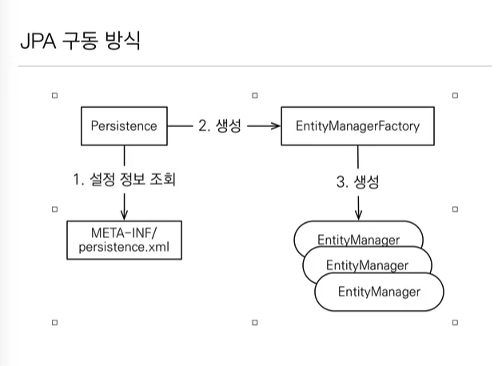
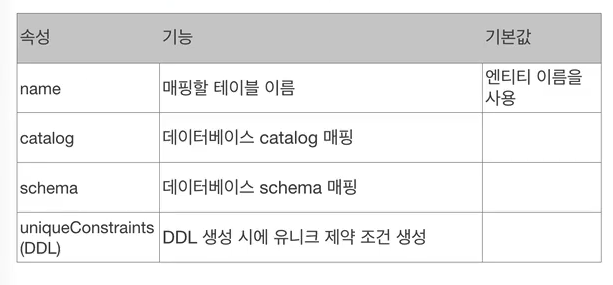
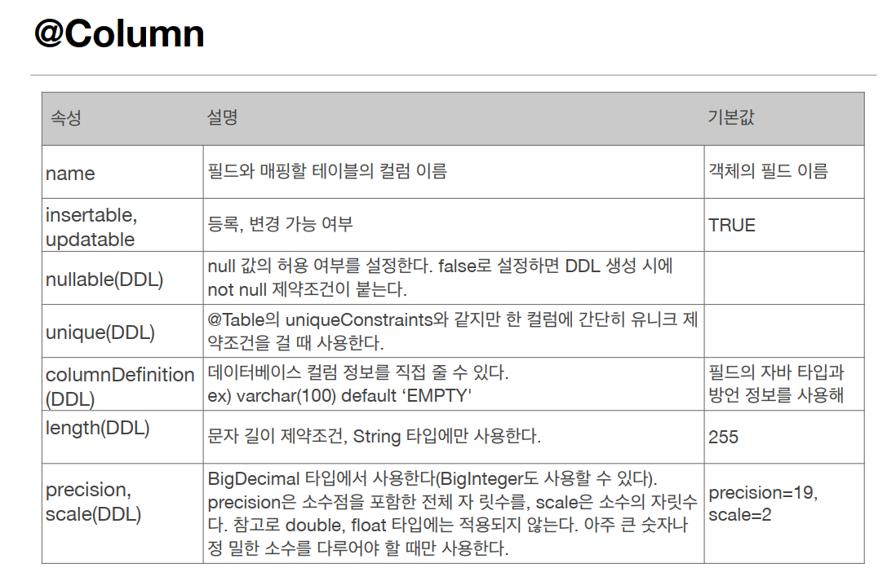
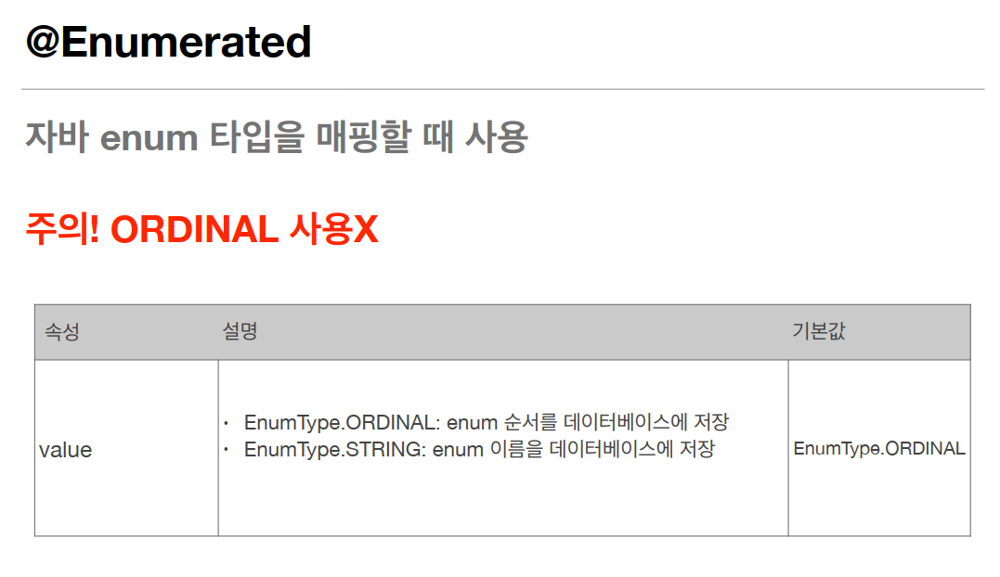
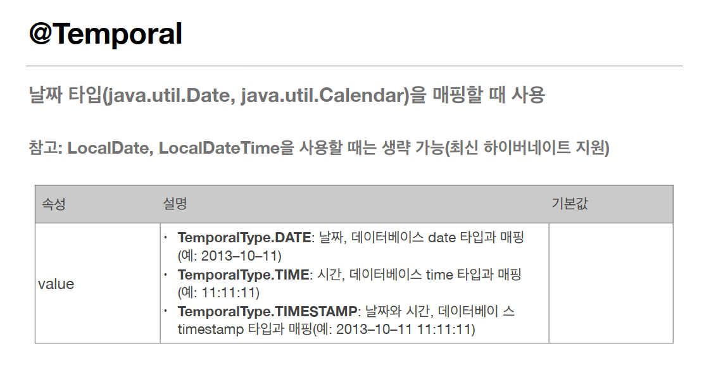
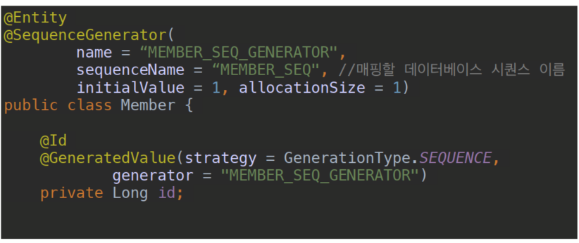
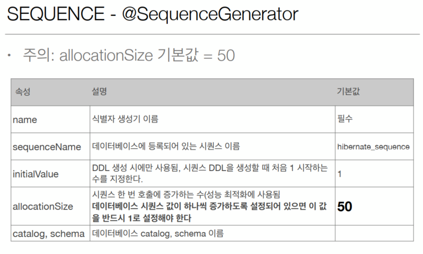
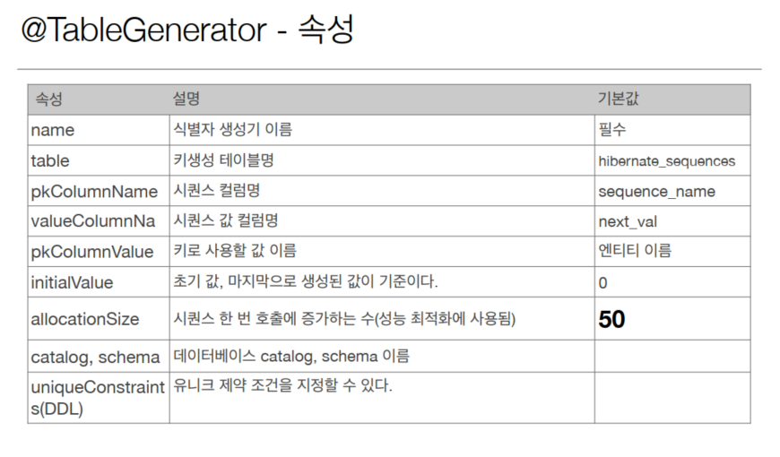

<<<<<<< Updated upstream

=======

# JPQL
- JPA를 사용하면 엔티티 객체를 중심으로 개발
- 문제는 검색 쿼리
- 검색을 할 때도 테이블이 아닌 엔티티 객체를 대상으로 검색
- 모든 DB 데이터를 객체로 변환해서 검색하는 것을 불가능
- 애플리케이션이 필요한 데이터만 DB에서 불러오려면 결국 검색 조건이 포함된 SQL이 필요
- JPA는 SQL을 추상화한 JPQL이라는 객체 지향 쿼리 언어를 제공
- SQL과 문법 유사, SELECT, FROM, WHERE, GROUP BY, HAVING, JOIN 지원
- JPQL은 엔티티 객체를 대상으로 쿼리
- SQL은 데이터베이스 테이블을 대상으로 쿼리
- 테이블이 아닌 객체를 대상으로 검색하는 객체 지향 쿼리
- SQL을 추상화해서 특정 데이터베이스 SQL에 의존X
- JPQL을 한마디로 정의하면 객체 지향 SQL

# 엔티티의 생명주기
- 비영속 (new/transient): 영속성 컨텍스트와 전혀 관계가 없는 새로운 상태
- 영속 (managed): 영속성 컨텍스트에 관리되는 상태
- 준영속 (detached): 영속성 컨텍스트에 저장되었다가 분리된 상태
- 삭제 (removed): 삭제된 상태

# 영속성 컨텍스트의 이점
- 1차 캐시
- 동일성(identity) 보장
- 트랜잭션을 지원하는 쓰기 지연 (transactional write-behind)
- 변경 감지(Dirty Checking)
- 지연 로딩(Lazy Loading)

# 플러시(flush)
영속성 컨텍스트의 변경내용을 데이터베이스에 반영

## 플러시 발생
- 변경 감지
- 수정된 엔티티 쓰기 지연 SQL 저장소에 등록
- 쓰기 지연 SQL 저장소의 쿼리를 데이터베이스에 전송 (등록, 수정, 삭제 쿼리)
## 영속성 컨텍스트를 플러시하는 방법
- em.flush() - 직접 호출
- 트랜잭션 커밋 - 플러시 자동 호출
- JPQL 쿼리 실행 - 플러시 자동 호출
## 플러시 모드 옵션
em.setFlushMode(FlushModeType.COMMIT)
- FlushModeType.AUTO: 커밋이나 쿼리를 실행할 때 플러시 (기본값)
- FlushModeType.COMMIT: 커밋할 때만 플러시

## 플러시는!
- 영속성 컨텍스트를 비우지 않음
- 영속성 컨텍스트의 변경내용을 데이터 베이스에 동기화
- 트랜잭션이라는 작업 단위가 중요 -> 커밋 직전에만 동기화 하면 됨

# 준영속 상태
- 영속 -> 준영속
- 영속 상태의 엔티티가 영속성 컨텍스트에서 분리(detached)
- 영속성 컨텍스트가 제공하는 기능을 사용 못함

## 준영속 상태로 만드는 방법
- em.detach(entity): 특정 엔티티만 준영속 상태로 전환
- em.clear(): 영속성 컨텍스트를 완전히 초기화
- em.close(): 영속성 컨텍스트를 종료

# 엔티티 매핑
## @Entity
- @Entity가 붙은 클래스는 JPA가 관리, 엔티티라 한다.
- JPA를 사용해서 테이블과 매핑할 클래스는 @Entity 필수
- 주의
  - 기본 생성자 필수(파라미터가 없는 public 또는 protected 생성자)
  - final 클래스, enum, interface, inner 클래스 사용X
  - 저장할 필드에 final 사용X
- 속성: name
  - JPA에서 사용할 엔티티 이름을 지정한다.
  - 기본값: 클래스 이름을 그대로 사용(예: Member)
  - 같은 클래스 이름이 없으면 가급적 기본값을 사용한다.
## @Table
- @Table은 엔티티와 매핑할 테이블 지정

## 데이터베이스 스키마 자동 생성
- DDL을 애플리케이션 실행 시점에 자동 생성
- 테이블 중심 -> 객체 중심
- 데이터베이스 방언을 활용해서 데이터베이스에 맞는 적절한 DDL 생성
- 이렇게 생선된 DDL은 개발 장비에서만 사용
- 생성된 DDL은 운영 서버에서는 사용하지 않거나, 적절히 다듬은 후 사용
- persistence.xml 파일 설명 참조

## 데이터베이스 스키마 자동 생성 -주의
- 운영 장비에는 절대 create, create-drop, update 사용하면 안된다.
- 개발 초기 단계는 create 또는 update
- 테스트 서버는 update 또는 validate
- 스테이징과 운영 서버는 validate 또는 none

## DDL 생성 기능
- 제약조건 추가: 회원 이름은 필수, 10자 초과X
  - @Column(nullable = false, length = 10)
- 유니크 제약조건 추가
  - @Table(uniqueConstraints = {@UniqueConstraint(name = "NAME_AGE_UNIQUE", columnNames = {"NAME", "AGE"})})
- DDL 생성 기능은 DDL을 자동 생성할 때만 사용되고 JPA의 실행 로직에는 영향을 주지 않는다.

## @Column 속성

## @Enumerated 속성

## Temporal 속성

## @Lob
데이터베이스 BLOB, CLOB 타입과 매핑
- @Lob 에는 지정할 수 있는 속성이 없다.
- 매핑하는 필드 타입이 문자면 CLOB 매핑, 나머지는 BLOB 매핑
  - CLOB: String, Char[], java.sql.CLOB
  - BLOB: byte[], java.sql.BLOB
## @Transient
- 필드 매핑X
- 데이터베이스에 저장X, 조회X
- 주로 메모리상에서만 임시로 어떤 값을 보관하고 싶을 때 사용

# 기본 키 매핑
## 기본 키 매핑 어노테이션
- @Id
- @GeneratedValue
## 기본 키 매핑 방법
- 직접 할당: @Id만 사용
- 자동 생성(@GeneratedValue)
  - IDENTITY: 데이터베이스에 위임, MYSQL
  - SEQUENCE: 데이터베이스 시퀀스 오브젝트 사용, ORACLE
    - @SequenceGenerator 필요
  - TABLE: 키 생성용 테이블 사용, 모든 DB에서 사용
    - @TableGenerator 필요
  - AUTO: 방언에 따라 자동 지정, 기본값 
## IDENTITY 전략 - 특징
- 기본 키 생성을 데이터베이스에 위임
- 주로 MYSQL, PostgreSQL, SQL Server, DB2에서 사용 (예: MySQL의 AUTO_INCREMENT)
- JPA는 보통 트랜잭션 커밋 시점에 INSERT SQL 실행
- AUTO_INCREMENT는 데이터베이스에 INSERT SQL을 실행 한 이후에 ID 값을 알 수 있음
- IDENTITY 전략은 em.persist() 시점에 즉시 INSERT SQL 실행 하고 DB에서 식별자를 조회 
## SEQUENCE 전략 - 특징
- 데이터베이스 시퀀스는 유일한 값을 순서대로 생성하는 특별한 데이터베이스 오브젝트(예: 오라클 시뭔스)
- 오라클, PostgreSQL, DB2, H2 데이터베이스에서 사용
## SEQUENCE 전략 - 매핑

## TABLE 전략
- 키 생성 전용 테이블을 하나 만들어서 데이터베이스 시퀀스를 흉내내는 전략
- 장점: 모든 데이터베이스에 적용 가능
- 단점: 성능
## TableGenerator - 속성

## 권장하는 식별자 전략
- 기본 키 제약 조건: null 아님, 유일, 변하면 안 된다.
- 미래까지 이 조건을 만족하는 자연키는 찾기 어렵다. 대리키(대체키)를 사용하자.
- 예를 들어 주민등록번호도 기본 키로 적절하지 않다.
- 권장: Long형 + 대체키 + 키 생성 전략 사용
>>>>>>> Stashed changes
